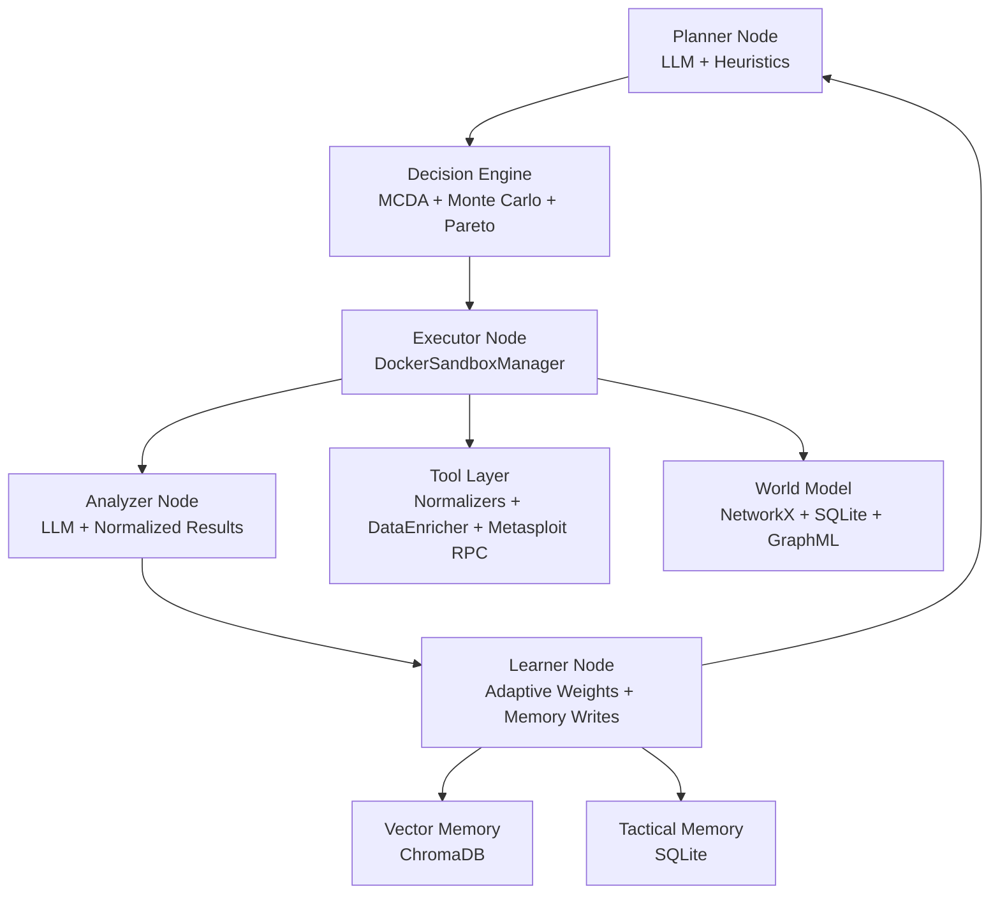

# Architecture

```mermaid
flowchart TD
    A[Planner Node\nLLM + Heuristics] --> B[Decision Engine\nMCDA + Monte Carlo + Pareto]
    B --> C[Executor Node\nDockerSandboxManager]
    C --> D[Analyzer Node\nLLM + Normalized Results]
    D --> E[Learner Node\nAdaptive Weights + Memory Writes]
    E --> A

    C --> T[Tool Layer\nNormalizers + DataEnricher + Metasploit RPC]
    E --> M1[Vector Memory\nChromaDB]
    E --> M2[Tactical Memory\nSQLite]
    C --> W[World Model\nNetworkX + SQLite + GraphML]
```

## Core Guarantees
- Closed autonomous loop with explicit halt conditions.
- Fully offline runtime architecture.
- Stateful execution with checkpointing and resumability.
