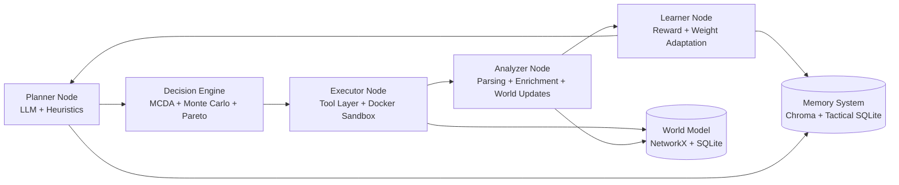

# Architecture

## Основные узлы

- **Planner**: генерирует действия динамически через LLM и эвристики.
- **Decision Engine**: оценивает и выбирает действия с учетом trade-off.
- **Executor**: выполняет действия через sandbox + tool adapters.
- **Analyzer**: извлекает артефакты и обновляет world model.
- **Learner**: корректирует стратегию для следующих циклов.
