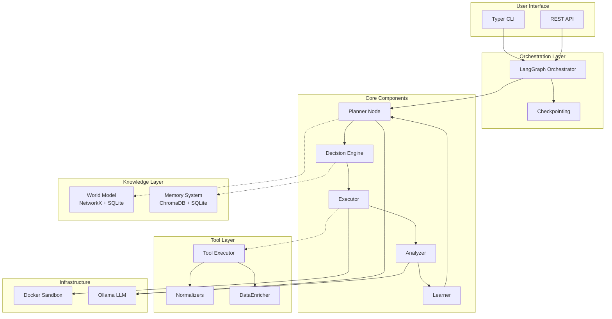
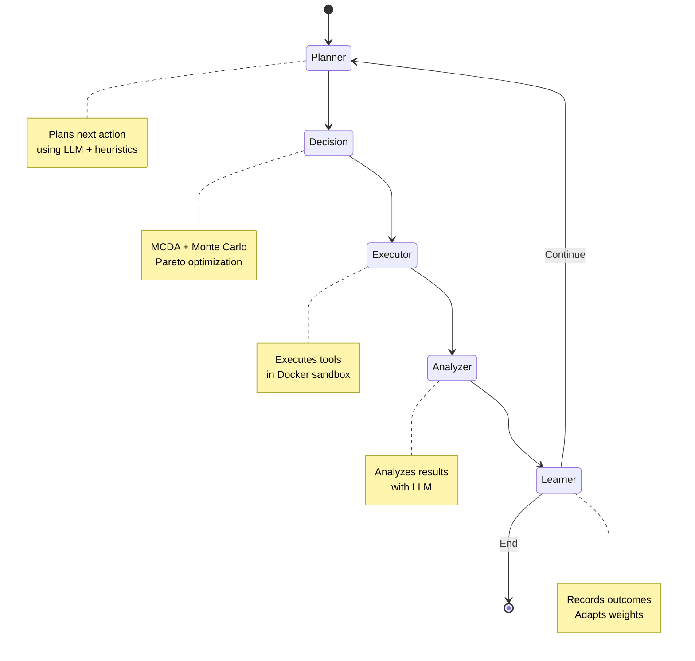
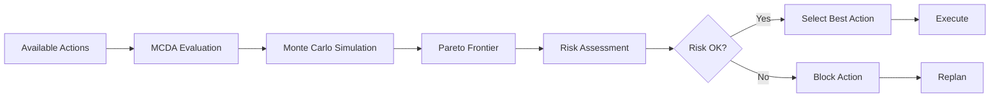
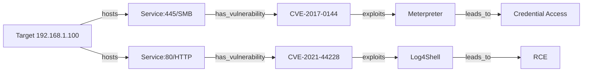
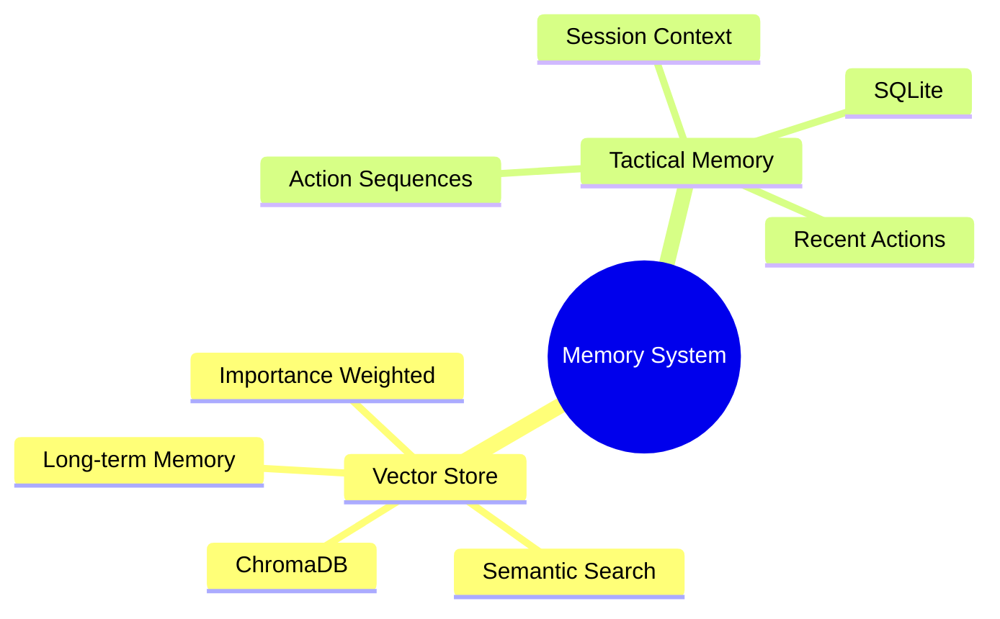
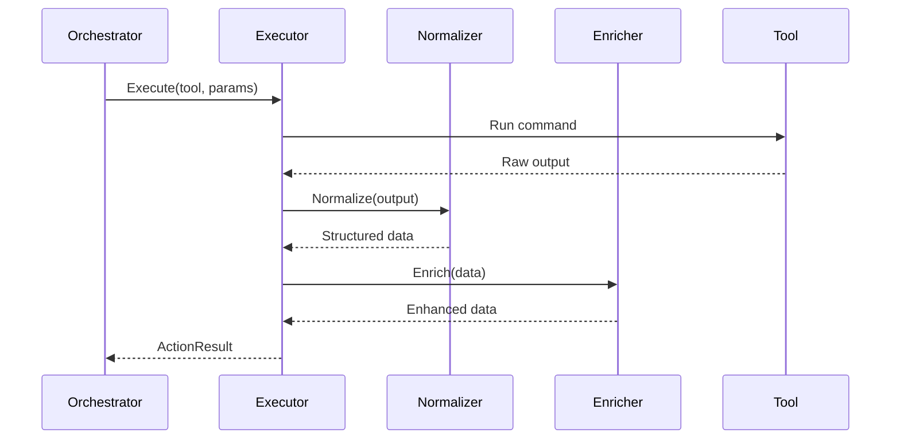
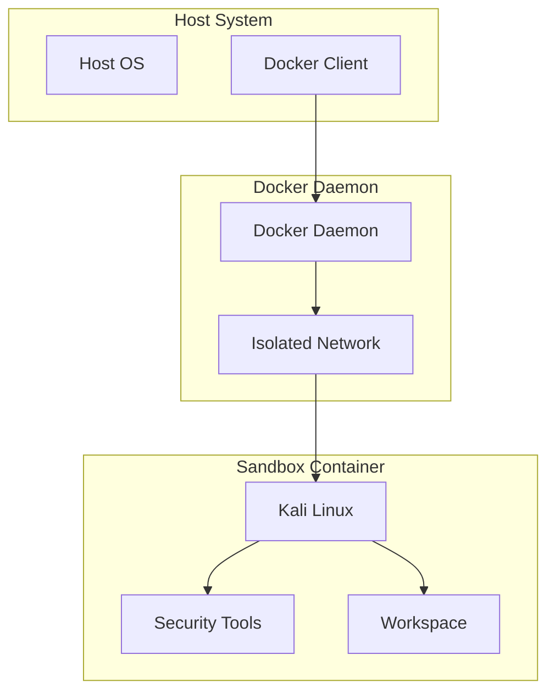
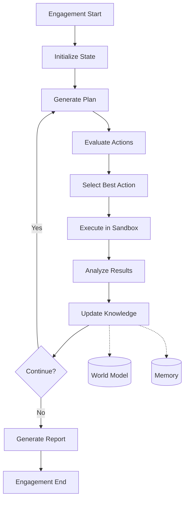
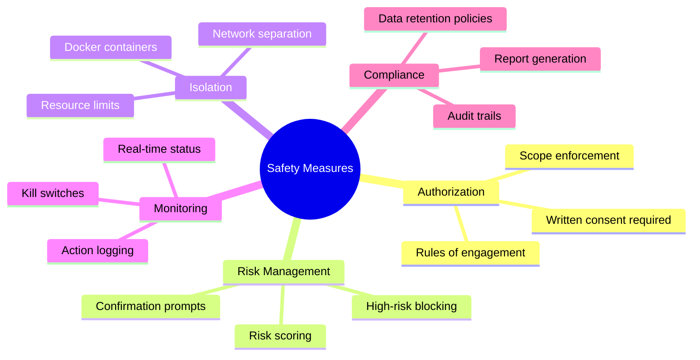
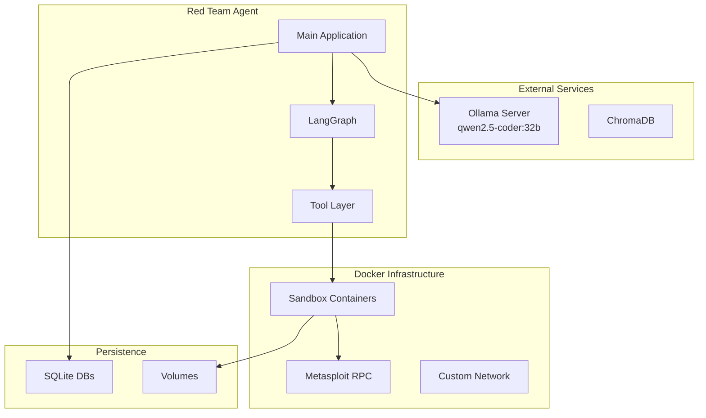

# Red Team Agent v2.0 - Architecture

## System Overview

The Red Team Agent is an autonomous penetration testing system powered by local LLMs. It operates in a fully closed feedback loop, making intelligent decisions about attack strategies while maintaining safety and adaptability.

## High-Level Architecture

## Component Details

### 1. LangGraph Orchestrator

The orchestrator implements the agent's workflow as a state machine using LangGraph:

### 2. Decision Engine

Implements sophisticated decision-making:

**Features:**
- Multi-Criteria Decision Analysis (MCDA)
- Monte Carlo simulation for outcome probability
- Pareto frontier optimization
- Adaptive weight adjustment
- Risk-aware filtering

### 3. World Model

Graph-based representation of the engagement state:

**Node Types:**
- TARGET: IP addresses, hostnames
- SERVICE: Running services
- VULNERABILITY: CVEs, weaknesses
- CREDENTIAL: Discovered credentials
- ACTION: Executed actions
- FINDING: Analysis results

### 4. Memory System

Two-level memory architecture:

### 5. Tool Layer

Abstracted tool execution with intelligent parsing:

### 6. Docker Sandbox

Isolated execution environment:

**Features:**
- Resource limits (CPU, memory)
- Network isolation
- Snapshot/restore
- Volume mounts
- Health monitoring

## Data Flow

## Security Considerations

## Deployment Architecture

## Performance Characteristics

| Component | Latency | Throughput |
|-----------|---------|------------|
| LLM Inference | 2-10s | 10 tokens/s |
| Decision Engine | <100ms | 1000 evals/s |
| Tool Execution | 1-60s | Variable |
| Memory Search | <50ms | 100 queries/s |
| Graph Operations | <10ms | 10000 ops/s |

## Scalability

The architecture supports horizontal scaling through:
- Stateless orchestrator instances
- Distributed vector store
- Multiple sandbox containers
- Load-balanced LLM endpoints
