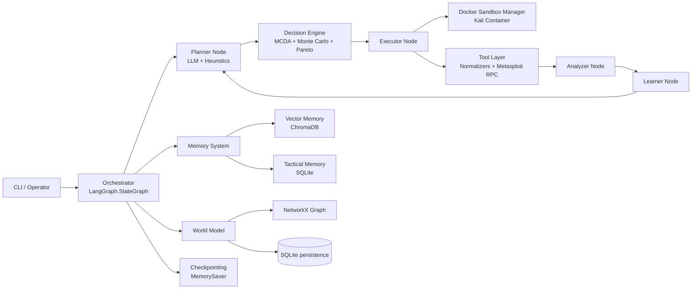

# Architecture

## Dataflow
1. Planner генерирует действия (LLM + эвристики).
2. Decision Engine ранжирует действия и выбирает Pareto-efficient кандидат.
3. Executor запускает инструмент в Docker sandbox.
4. Analyzer извлекает сущности, строит вывод и сигнал успеха.
5. Learner обновляет веса стратегии, память и world model.
6. Цикл повторяется до `max_iterations` или `halt`.
